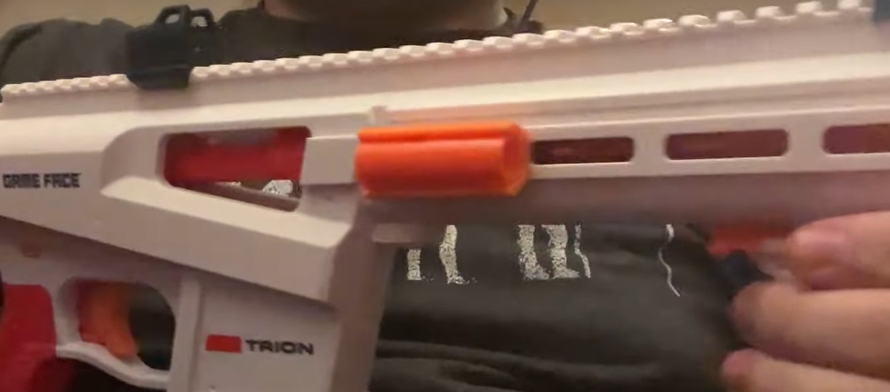

- **Spacer Holders**
- - 3 types
- - Picatinny mounted
- - Buffer tube mounted
- - MLOK slot mounted

Video overviews for each type:
- Picatinny: https://www.youtube.com/watch?v=uZAEKnahiVE
- Buffer Tube: https://www.youtube.com/watch?v=xto3nh-cuSI
- MLOK: https://www.youtube.com/watch?v=Of9Gyap_H0w

All parts must be printed on their ends. The MLOK spacer holder requires supports. The MLOK and Picatinny holders should be printed with a brim. 

